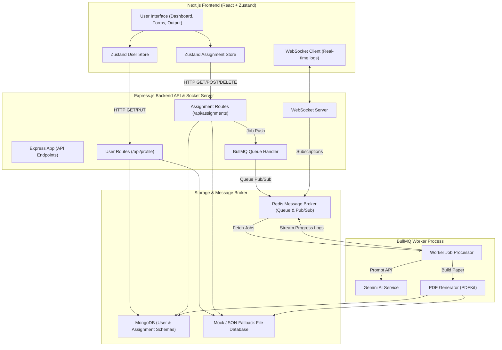

# VedaAI - AI Assessment Creator

VedaAI is an advanced, premium AI-powered Assessment Creator designed for educators. It enables teachers to instantly generate structured question papers (MCQs, Short Answers, Long Answers, and Very Long Answers), stream live WebSocket logs of the generation progress, view interactive class performance analytics, toggle between light and dark modes, and manage customized teacher profiles.

---

## Architecture Overview

The system follows a decoupling-first model using a Next.js Frontend, an Express Backend API, a Redis-backed BullMQ job queue, and a MongoDB or local JSON fallback database integrated with the Google Gemini AI API for intelligent paper generation.

### System Architecture Flow



### Flow Breakdown:
1. **Form Submission**: The teacher submits the assignment requirements (subject, class, question types, time limit) via the UI.
2. **Database & Queueing**: The API writes a new pending record to MongoDB (or mock fallback `mock_db.json`) and triggers a generation job on the Redis-backed BullMQ.
3. **WebSocket Handshake**: The frontend connects to the WebSocket server subscribing to the assignment ID room to receive real-time updates.
4. **AI Generation (Gemini)**: The queue worker picks up the job, constructs a structured prompt, invokes the Google Gemini API (using the `gemini-2.5-flash` model), and processes the response.
5. **Real-time Log Stream**: Every incremental step (loading context, generating MCQs, formatting sections) is published to the Redis channel and sent via WebSockets to the frontend.
6. **PDF Creation**: The worker compiles the generated sections into a PDF using PDFKit and updates the assignment status to `completed`.

### Why Google Gemini 2.5 Flash?

The platform uses Google **Gemini 2.5 Flash** specifically to power the AI Assessment Creator due to its industry-leading characteristics:
- **Ultra-Low Latency**: Highly optimized for speed, producing question generation results within seconds to support real-time progress streaming.
- **Cost Efficiency**: High-performance reasoning at a fraction of the API cost of larger LLMs, keeping high-volume generation extremely affordable.
- **Enormous Context Window**: A native 1M+ token limit easily handles extensive course syllabi, formatting rules, and complex rubric guidelines.
- **Reliable Structured Outputs**: Consistent JSON payloads that match MongoDB schema requirements without parse errors.

---

## Frontend Features & Design System

The frontend is a bespoke React/Next.js application styled using Vanilla CSS variables for high-fidelity animations, theme transitions, and layout structure:

* **Premium Glassmorphic UI**: Sleek, modern cards using backdrop filters, glowing subtle gradients, transparent border treatments, and premium hover translation transformations.
* **Global Dark & Light Modes**: A fully integrated layout color token system with a toggle switch in the header. The application preserves the active mode in `localStorage` across page visits.
* **UI Polish & Details**:
  * **Branding & Logo**: Centered orange/black gradient brand logo on the sidebar (Icon: `52px`, Text: `28px`).
  * **Aligned Form Elements**: Uniform `38px` height with responsive box-sizing for question type selectors, custom numeric steppers, and row deletion buttons.
  * **Relative Dropdowns**: Header dropdown panels (Profile settings and Notifications) position dynamically relative to their triggers to prevent clamping to screen edges.
* **Full Mobile Responsiveness**:
  * **Collapsible Sidebar**: Auto-collapses into a mobile drawer with overlay blur; toggled via a hamburger menu in the header.
  * **Responsive Stats Grid**: Translates from a multi-column dashboard grid into 2-column or 1-column layouts dynamically.
  * **Block-Stacked Question Table**: Restructures the question configuration tables into grid cards with CSS-prepended row label descriptions on small screens (`<= 600px`).
  * **Vertical Stacked Actions**: Forms, due dates, action bars, and option buttons stack vertically with `100%` width tap areas on mobile.
* **WebSocket Progress Terminal**: A retro command-line log widget integrated into the loading screen that streams live backend worker status updates during generation.
* **Glassmorphic Generation Screen**: An interactive full-screen overlay displaying a clean, responsive progress circular loader and the log terminal.
* **Dynamic Teacher Profile settings**: Edit full name, school, and branch with real-time UI updates reflected immediately in the sidebar and dashboard greetings.
* **Standalone Assignments Dashboard**: A dedicated page with instant search, filterable lists, card status tags, and action dropdowns (View, Delete).
* **Interactive Performance Analytics**: Dashboard widgets showcasing hours saved, graded submissions, and interactive detail modal pop-ups.
* **Exam Preview & Toggleable Answer Keys**: Read-only layout resembling standard paper, equipped with print functionality, dynamic PDF downloads, and toggles for showing or hiding answer keys.

---

## Backend Features

* **Express API Architecture**: Modular routers managing user profiles and assignment data models.
* **BullMQ Queue Handling**: Offloads heavy AI generation jobs to a Redis-backed queue for reliable background processing.
* **WebSocket integration**: Delivers step-by-step logs directly from the queue worker to the client.
* **High-Fidelity Mock Fallback Mode**: Automatically falls back to memory/file-based JSON DB storage (`backend/mock_db.json`) if MongoDB or Redis are not running, enabling easy grading without databases.
* **Dynamic PDF Generator**: Generates formatted, standard-compliant PDF documents using PDFKit with dynamic server URL environment resolution, dynamic creator school whitelists, and safe character encoding (pipe ` | ` separators) to avoid encoding breakages.

---

## Configuration Setup

### Backend Configuration
Create a `.env` file in the `backend/` directory:
```env
PORT=5000
MONGODB_URI=mongodb+srv://<username>:<password>@cluster0.abcde.mongodb.net/vedaai?retryWrites=true&w=majority
REDIS_URL=rediss://default:<password>@your-redis-broker.upstash.io:6379
GEMINI_API_KEY=AIzaSy...YourGeminiAPIKeyHere
```
*Note: If MongoDB or Redis are not detected, the backend will enter Mock Fallback Mode, storing data in `backend/mock_db.json` and running generation tasks synchronously in memory.*

### Frontend Configuration
Create a `.env` file in the `frontend/` directory:
```env
NEXT_PUBLIC_API_URL=https://your-backend-service.onrender.com/api
NEXT_PUBLIC_WS_URL=wss://your-backend-service.onrender.com
```

---

## How to Run the Project Locally

### Step 1: Initialize MongoDB and Redis (via Docker)
Start isolated database and cache services:
```bash
docker run -d --name veda-mongodb -p 27017:27017 mongo:latest
docker run -d --name veda-redis -p 6379:6379 redis:latest
```

### Step 2: Run Backend
Open a terminal in the `/backend` directory:
```bash
npm install
npm run dev
```
*The backend API server will list on `http://localhost:5000`.*

### Step 3: Run Frontend
Open a separate terminal in the `/frontend` directory:
```bash
npm install
npm run dev
```
*Open your browser and visit `http://localhost:3000`.*

---

## Production Deployment Guide

### 1. Databases Setup
* **MongoDB Atlas (Free Database)**: Create an M0 Free Cluster. Under **Network Access**, add IP `0.0.0.0/0` (Allow Access from Anywhere) to whitelist Render. Write down your connection string and database user password.
* **Upstash (Free Redis)**: Create a free serverless Redis database and copy the `rediss://...` connection string.

### 2. Backend Deployment (Render)
Deploy a **Web Service** from your GitHub repository:
* **Root Directory**: `backend`
* **Build Command**: `npm install && npm run build`
* **Start Command**: `node dist/index.js`
* **Environment Variables**:
  * `MONGODB_URI`: (Your MongoDB connection string with real password replaced)
  * `REDIS_URL`: (Your Upstash Redis connection string)
  * `GEMINI_API_KEY`: (Your Google Gemini API Key)

### 3. Frontend Deployment (Vercel)
Deploy a new project from your GitHub repository:
* **Root Directory**: `frontend`
* **Framework Preset**: `Next.js`
* **Environment Variables**:
  * `NEXT_PUBLIC_API_URL`: `https://your-backend-service.onrender.com/api` (use your Render web service URL with `/api` appended)
  * `NEXT_PUBLIC_WS_URL`: `wss://your-backend-service.onrender.com` (use your Render web service URL with `https://` replaced by `wss://`)
