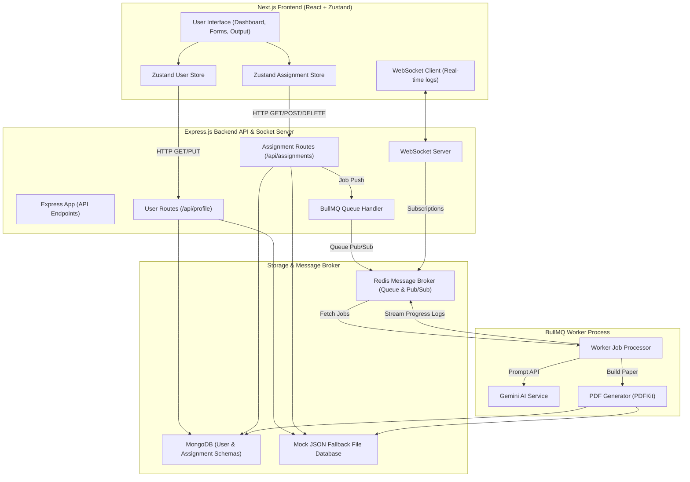

# VedaAI - AI Assessment Creator

VedaAI is an advanced, premium AI-powered Assessment Creator designed for educators. It enables teachers to instantly generate structured question papers (MCQs, Short Answers, Long Answers, and Very Long Answers), stream live WebSocket logs of the generation progress, view interactive class performance analytics, toggle between light and dark modes, and manage customized teacher profiles.

## Architecture Overview

The system follows a decoupling-first model using a Next.js Frontend, an Express Backend API, a Redis-backed BullMQ job queue, and a MongoDB / local JSON fallback store integrated with the Google Gemini AI API for intelligent paper generation.

### System Architecture Flow



### Flow Breakdown:
1. **Form Submission**: The teacher submits the assignment requirements (subject, class, question types, time limit) via the UI.
2. **Database & Queueing**: The API writes a new pending record to MongoDB (or mock fallback `mock_db.json`) and triggers a generation job on the Redis-backed BullMQ.
3. **WebSocket Handshake**: The frontend connects to the WebSocket server subscribing to the assignment ID room to receive real-time updates.
4. **AI Generation (Gemini)**: The queue worker picks up the job, constructs a structured prompt, invokes the Google Gemini API (using the `gemini-2.5-flash` model), and processes the response.
5. **Real-time Log Stream**: Every incremental step (loading context, generating MCQs, formatting sections) is published to the Redis channel and sent via WebSockets to the frontend.
6. **PDF Creation**: The worker compiles the generated sections into a PDF using PDFKit and updates the assignment status to `completed`.

---

## Core Features Implemented

- **AI Question Generation Form**: Set question types (including MCQ, Short Answer, Long Answer, and Very Long Answer), counts, marks per question, allowed time, and specify custom additional instructions or upload reference materials.
- **Aligned Form Elements**: The Configure Question Types table features a perfectly aligned grid. All select dropdowns, stepper controls, numeric inputs, and trash icons share a matching `38px` height with responsive box-sizing, resolving all vertical and horizontal spacing alignment glitches.
- **Support for Basic Subjects**: Added drop-down selectors and template support for Mathematics, Science, English, Social Studies, Computers, and Hindi.
- **WebSocket Streaming Log Terminal**: Displays live worker processing progress and logging logs in a vintage terminal widget.
- **Premium Glassmorphic Loader**: Redesigned generation overlay with a glassmorphism theme, progress percentage tracker, and responsive streaming log container that adapts to both light and dark backgrounds.
- **Global Dark Mode**: Fully integrated layout color tokens with a toggle button in the header and persistent state saved via `localStorage`. All input controls, buttons, checkboxes, dialog boxes, and the exam page preview adapt to the selected theme.
- **Dynamic Teacher Profile & Settings**: Edit full name, school details, and branch directly in the app. Updates the sidebar card and main welcome greeting dynamically.
- **Separated Assignments Dashboard**: A standalone `/assignments` page equipped with instant fuzzy-search, card option dropdowns ("View Paper", "Delete"), status tagging, and pagination cards.
- **Toned Down Analytics Widgets**: Realistic dashboard mock metrics (38 graded submissions, 12.4 hours saved) with details pop-ups and certified educator badge gamification systems.
- **Toggleable Answer Keys**: Inside the assignment detail page, teachers can toggle answer keys visibility, print, or download PDFs.
- **Production-Ready PDF Exporter**: PDF generation uses standard ASCII pipe separators (` | `) instead of Unicode characters, preventing encoding issues and double dashes. The PDF download action dynamically resolves production endpoints using `process.env.NEXT_PUBLIC_API_URL`.

---

## Requirements and Prerequisites

### Softwares Required:
- **Node.js** (v18.0.0 or higher)
- **NPM** (v9.0.0 or higher)
- **Docker & Docker Compose** (Recommended for local Redis and MongoDB services)

### API Credentials:
- **Google Gemini API Key**: Obtain one from Google AI Studio.

---

## Configuration Setup

### Backend Environment Configuration
Create a `.env` file in the `backend/` directory:
```env
PORT=5000
MONGODB_URI=mongodb://localhost:27017/vedaai
REDIS_URL=redis://localhost:6379
GEMINI_API_KEY=AIzaSyDFCf...YourGeminiAPIKeyHere
```
*Note: If MongoDB or Redis are not detected, the backend will automatically enter Mock/Memory Fallback Mode, storing data locally in `backend/mock_db.json`/`mock_user.json` and running generation tasks synchronously in memory.*

### Frontend Environment Configuration
Create a `.env` file in the `frontend/` directory (optional, default endpoints are set to localhost):
```env
NEXT_PUBLIC_API_URL=http://localhost:5000/api
NEXT_PUBLIC_WS_URL=ws://localhost:5000
```

---

## How to Run the Project Locally

### Step 1: Initialize MongoDB and Redis (via Docker)
To start isolated MongoDB and Redis databases easily, execute the following command in your terminal:

```bash
docker run -d --name veda-mongodb -p 27017:27017 mongo:latest
docker run -d --name veda-redis -p 6379:6379 redis:latest
```

### Step 2: Install Dependencies & Run Backend
Open a terminal in the `/backend` directory:
```bash
# Install packages
npm install

# Start the compilation watcher and server using tsx
npm run dev
```
*The backend API server will list on `http://localhost:5000`.*

### Step 3: Install Dependencies & Run Frontend
Open a separate terminal in the `/frontend` directory:
```bash
# Install packages
npm install

# Launch the Next.js development server
npm run dev
```
*Open your browser and visit `http://localhost:3000`.*

---

## Verification and Building

To verify code safety and compile output:

### Backend Build Check
```bash
cd backend
npm run build
```

### Frontend Build Check
```bash
cd frontend
npm run build
```
Both projects compile with zero linter or TypeScript errors.

---

## 🚀 Walkthrough: Free Production Deployment Guide

Follow these steps to deploy the entire stack for free:

### 1. Database (MongoDB) - MongoDB Atlas Free Tier
1. Sign up for a free account at [MongoDB Atlas](https://www.mongodb.com/cloud/atlas).
2. Create a new project and select the **M0 Free Cluster**.
3. Choose your cloud provider and region, then click **Create**.
4. In Security -> Network Access, select **Allow Access From Anywhere** (`0.0.0.0/0`) or configure your backend deployment's IP.
5. In Security -> Database Access, create a database user and record the username and password.
6. Retrieve the connection string: select "Connect" -> "Drivers" -> copy the URL (looks like `mongodb+srv://<username>:<password>@cluster0.abcde.mongodb.net/?retryWrites=true&w=majority`).

### 2. Message Broker & Cache (Redis) - Upstash Serverless Redis
1. Sign up at [Upstash](https://upstash.com/).
2. Click **Create Database**.
3. Choose your preferred region, leave other options default, and click **Create**.
4. Scroll down to the **Node.js** / **iORedis** configuration section and copy the connection string (`rediss://default:...`).

### 3. Backend API & WebSockets - Render.com Free Tier
Render supports Node.js web services and native WebSockets.
1. Sign up at [Render](https://render.com/).
2. Click **New** -> **Web Service**.
3. Connect your GitHub repository.
4. Configure the service settings:
   - **Name**: `vedaai-backend`
   - **Root Directory**: `backend`
   - **Language**: `Node`
   - **Build Command**: `npm install && npm run build`
   - **Start Command**: `node dist/index.js`
   - **Instance Type**: **Free**
5. Add the following **Environment Variables** under the "Advanced" tab:
   - `PORT`: `10000` (Render will bind to this port automatically)
   - `MONGODB_URI`: `<Your MongoDB Atlas connection string>`
   - `REDIS_URL`: `<Your Upstash Redis connection string>`
   - `GEMINI_API_KEY`: `<Your Google Gemini API Key>`
6. Click **Create Web Service**. Render will deploy your backend at a URL like `https://vedaai-backend.onrender.com`.

### 4. Frontend Application (Next.js) - Vercel Free Tier
Vercel is the native hosting platform for Next.js and has a generous free tier.
1. Sign up at [Vercel](https://vercel.com/) and connect your GitHub account.
2. Click **Add New** -> **Project**.
3. Select your repository.
4. Configure the build parameters:
   - **Root Directory**: `frontend`
   - **Framework Preset**: `Next.js`
5. Add the following **Environment Variables**:
   - `NEXT_PUBLIC_API_URL`: `https://vedaai-backend.onrender.com/api` (use your Render web service URL with `/api` appended)
   - `NEXT_PUBLIC_WS_URL`: `wss://vedaai-backend.onrender.com` (use your Render web service URL with `https://` replaced by `wss://`)
6. Click **Deploy**. Vercel will build and launch your application globally. Your AI Assessment Creator is now live!
